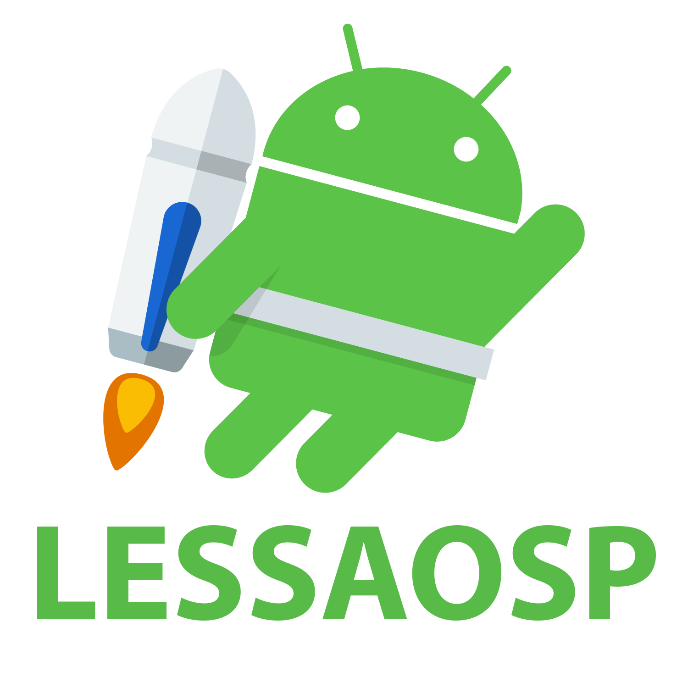

# HOW TO BUILD LESSAOSP ROM?

create a directory called as **lessaosp**

## Initialize local repository inside lessaosp folder
```## Initialize local repository
repo init -u https://github.com/LessAosp/manifest -b twelve
```
## Sync
```## Sync
repo sync -c -j$(nproc --all) --force-sync --no-clone-bundle --no-tags
```
# Build Process
```## Set up environment
. build/envsetup.sh
```

## Choose a target
```## Choose a target
lunch aosp_$device-userdebug
```
## Build the code
```## Build the code
make bacon -jX
```
# Credits
* [PixelExperience](https://github.com/PixelExperience)